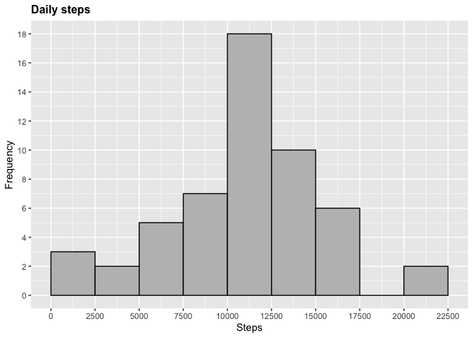
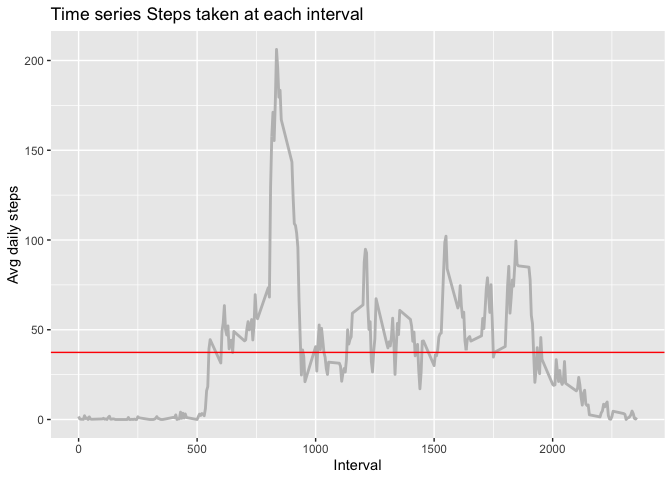
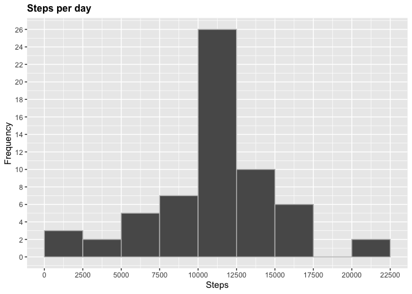
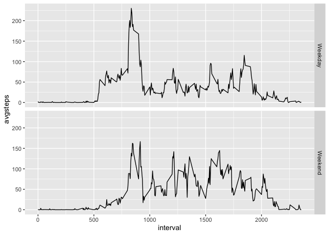

## Loading and preprocessing the data


```r
# Load libraries
library(ggplot2)


# 1. Loading data
dt <- read.csv(file = "activity.csv", header = TRUE)

# 2. Process/transform the data (if necessary) into a format suitable for your analysis
dt$day <- weekdays(as.Date(dt$date))
dt$DateTime<- as.POSIXct(dt$date, format="%Y-%m-%d")
dt_clean <- dt[!is.na(dt$steps),]
```


## What is mean total number of steps taken per day?


```r
# 1. Calculate the total number of steps taken per day
require(dplyr)
```

```
## Loading required package: dplyr
```

```
## 
## Attaching package: 'dplyr'
```

```
## The following objects are masked from 'package:stats':
## 
##     filter, lag
```

```
## The following objects are masked from 'package:base':
## 
##     intersect, setdiff, setequal, union
```

```r
#dailystep <- aggregate(dt_clean$steps ~ dt_clean$date, FUN=sum)
stepbyday <- dt %>% group_by(date) %>%
  summarise(dailystep = sum(steps, na.rm = TRUE), na = mean(is.na(steps)))

# prepare data for histogram (eliminate NAs)
stepbyday_clean <- filter(stepbyday, na == 0)

# 2. If you do not understand the difference between a histogram and a barplot, research the difference between them. Make a histogram of the total number of steps taken each day
p <- ggplot(stepbyday_clean, aes(dailystep)) +
  geom_histogram(boundary=0, binwidth=2500, col="black", fill="grey")+
  ggtitle("Daily steps")+
  xlab("Steps")+ylab("Frequency")+
  theme(plot.title = element_text(face="bold", size=12))+
  scale_x_continuous(breaks=seq(0,25000,2500))+scale_y_continuous(breaks=seq(0,18,2))

p
```

<!-- -->

```r
# 3. Calculate and report the mean and median of the total number of steps taken per day
paste("Mean = ", mean(stepbyday_clean$dailystep, na.rm = TRUE))
```

```
## [1] "Mean =  10766.1886792453"
```

```r
paste("Median = ", median(stepbyday_clean$dailystep, na.rm = TRUE))
```

```
## [1] "Median =  10765"
```


## What is the average daily activity pattern?


```r
# 1. Make a time series plot (i.e.type="l") of the 
# 5-minute interval (x-axis) and the average number of steps taken, averaged across
# all days (y-axis)

# reshape first
stepbyinterval <- dt_clean %>% group_by(interval) %>%
  summarise(avgstep = mean(steps, na.rm = TRUE))

# plot
ggplot(stepbyinterval, aes(x = interval , y = avgstep)) + 
        geom_line(color="grey", size=1) + 
        labs(title = "Time series Steps taken at each interval", x = "Interval", y = "Avg daily steps") +
        geom_hline(yintercept = mean(stepbyinterval$avgstep), color="red")
```

<!-- -->

```r
# 2. Which 5-minute interval, on average across all the days in the dataset, 
# contains the maximum number of steps?
stepbyinterval$interval[which(stepbyinterval$avgstep == max(stepbyinterval$avgstep))]
```

```
## [1] 835
```

## Imputing missing values


```r
# 1. Calculate and report the total number of missing values in the dataset (i.e. the total number of rows with \color{red}{\verb|NA|}NAs)

#summary(dt)
paste("Total NA's = ", sum(is.na(dt$steps)))
```

```
## [1] "Total NA's =  2304"
```

```r
#table(is.na(dt))

# 2. Devise a strategy for filling in all of the missing values in the dataset. The strategy does not need to be sophisticated. For example, you could use the mean/median for that day, or the mean for that 5-minute interval, etc.

print("Strategy: Filling in all the missing values with average value of steps for the corresponding intervals.")
```

```
## [1] "Strategy: Filling in all the missing values with average value of steps for the corresponding intervals."
```

```r
# 3. Create a new dataset that is equal to the original dataset but with the missing data filled in.

# impute non NA steps into a new col
dt$steps_new <- ifelse(is.na(dt$steps), round(stepbyinterval$avgstep[match(dt$interval, stepbyinterval$interval)],0), dt$steps)

dt_final <- data.frame(steps = dt$steps_new, interval = dt$interval, date = dt$date)

# 4. Make a histogram of the total number of steps taken each day and Calculate and report the``1234567890- mean and median total number of steps taken per day. Do these values differ from the estimates from the first part of the assignment? What is the impact of imputing missing data on the estimates of the total daily number of steps?

# generate new dataset with missing values replaced.
stepbyday_final <- dt_final %>% group_by(date) %>%
  summarise(dailystep = sum(steps, na.rm = TRUE))

# histogram
p2 <- ggplot(stepbyday_final, aes(dailystep))+
  geom_histogram(boundary=0, binwidth=2500, col="grey")+
  ggtitle("Steps per day")+
  xlab("Steps")+
  ylab("Frequency")+
  theme(plot.title = element_text(face="bold", size=12))+
  scale_x_continuous(breaks=seq(0,25000,2500))+
  scale_y_continuous(breaks=seq(0,26,2))

p2
```

<!-- -->

```r
mean(stepbyday_final$dailystep, na.rm = TRUE)
```

```
## [1] 10765.64
```

## Are there differences in activity patterns between weekdays and weekends?  
###For this part the \color{red}{\verb|weekdays()|}weekdays() function may be of some help here. Use the dataset with the filled-in missing values for this part.


```r
# 1. Create a new factor variable in the dataset with two levels – “weekday” and “weekend” indicating whether a given date is a weekday or weekend day.

# add day column to start wtih.
dt_final$day <- weekdays(as.Date(dt_final$date))
# use ifelse to populate the new column [weekday]
dt_final$weekday <- ifelse(dt_final$day %in% c("Saturday", "Sunday"), "Weekend", "Weekday")

# 2. Make a panel plot containing a time series plot (i.e. type = "l") of the 5-minute interval (x-axis) and the average number of steps taken, averaged across all weekday days or weekend days (y-axis). See the README file in the GitHub repository to see an example of what this plot should look like using simulated data.

#summarise data to get avg per day split by weekday and weekend

dt_final_summarised <- dt_final %>% 
  group_by(interval, weekday) %>%
  summarise(avgsteps = mean(steps))

p3 <- ggplot(dt_final_summarised, aes(interval, avgsteps)) + 
  geom_line() +
  facet_grid(weekday ~.)

p3
```

<!-- -->
